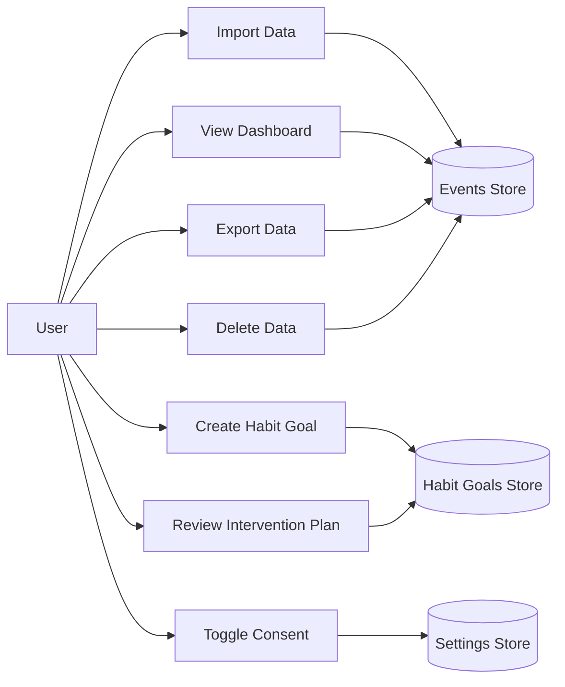
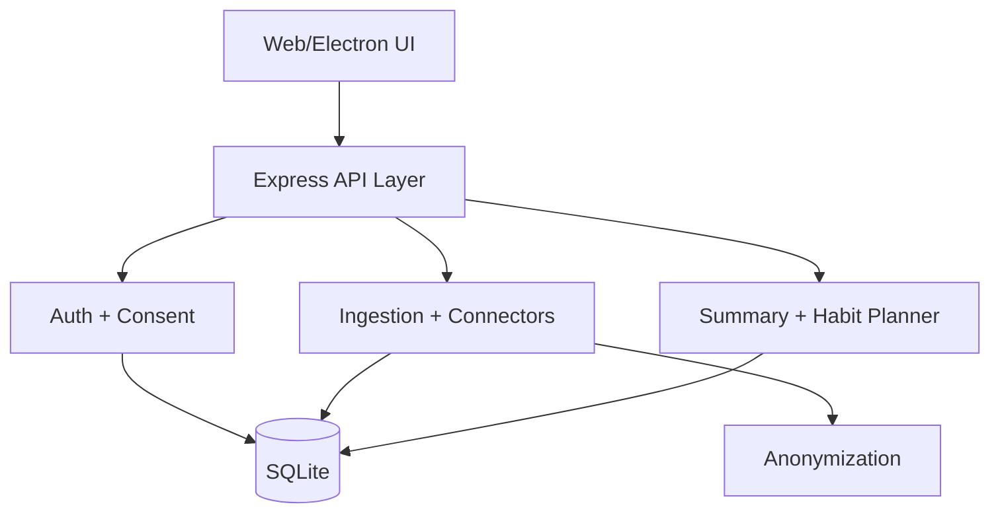
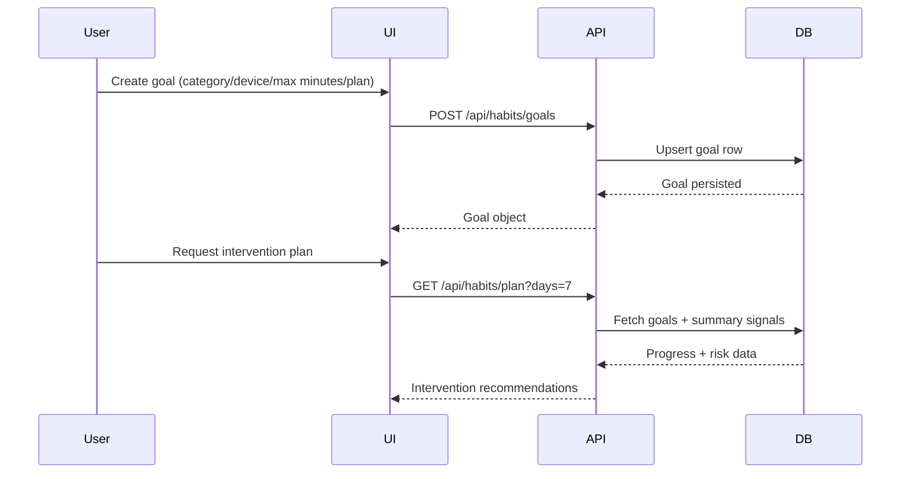

# Dissertation Depth and Evidence Pack (Insertion-Ready)

This pack expands the dissertation with high-value evidence rather than filler.

Use it to insert ready-to-paste subsections into:
- Chapter 2 (Analysis and Design)
- Chapter 3 (Realisation)
- Chapter 4 (Validation and Testing)
- Appendices

Evidence used here is grounded in the implemented repository artefacts:
- Backend/API implementation: `src/server.js`
- Data layer/schema and migration logic: `src/db.js`
- Privacy/anonymization logic: `src/anonymize.js`
- API and integration tests: `test/api.test.js`
- End-to-end UI test: `test/e2e.ui.test.js`
- Usability protocol and results: `artifacts/usability/README.md`, `artifacts/usability/results-template.csv`, `artifacts/usability/summary.md`

---

## Chapter 2 Addition: Personas, User Stories, and Use Cases

### 2.x Persona-Driven Requirements Refinement

To make the analysis traceable from stakeholder needs to implemented functions, two core personas were derived from project interviews and exploratory discussions.

#### Persona P1: University Student (Primary User)
- Profile: Undergraduate student balancing coursework, social messaging, and web browsing.
- Goal: Reduce unplanned time spent on high-distraction categories (especially social and browsing).
- Pain points:
  - Habit loops are often recognized only after extended sessions.
  - Existing trackers show totals but provide little guidance on interruption strategies.
  - Cross-device switching weakens manual control approaches.
- Success criteria:
  - Fast import and visibility of usage patterns.
  - Ability to set practical limits by category/device.
  - Actionable intervention prompts when behavior drifts.

#### Persona P2: Reflective Self-Manager (Privacy-Sensitive User)
- Profile: User willing to track behavior only if data remains local and controllable.
- Goal: Gain behavioral insight without cloud profiling risks.
- Pain points:
  - Concern over identifiable logs and external telemetry.
  - Lack of transparent delete/export controls in typical habit tools.
- Success criteria:
  - Consent toggle for collection control.
  - Pseudonymization of user identifiers.
  - Local export and full deletion functions.

### 2.x User Stories

#### Core user stories (implemented)
1. As a user, I want to import messaging and browsing history so that I can see where my time goes.
2. As a user, I want to set category-specific daily limits so that I can reduce harmful usage patterns.
3. As a user, I want intervention plans linked to my goals so that I have practical actions when limits are exceeded.
4. As a user, I want to disable consent at runtime so that I can stop data collection immediately.
5. As a privacy-sensitive user, I want identifiers anonymized and data export/deletion available so that I retain control over my records.

#### Acceptance criteria examples
- Import accepts supported connector payloads and adds events to the user profile.
- Goal creation persists title/category/device/max_daily_minutes/intervention_plan.
- When consent is disabled, event ingestion returns a denial response.
- Export excludes raw identifiers and includes hashed identity values only.

### 2.x Primary Use Cases

| Use case ID | Actor | Trigger | Main success path | Output |
|---|---|---|---|---|
| UC-01 | Student user | Wants baseline insight | Imports history/chat data and opens dashboard | Category, time, and trend summaries |
| UC-02 | Student user | Wants behavior change | Creates goal with max daily minutes + intervention plan | Goal appears in active list with progress |
| UC-03 | Privacy-sensitive user | Wants data control | Toggles consent off | Future event ingest is blocked |
| UC-04 | Privacy-sensitive user | Wants record portability | Requests export | Local CSV export generated |
| UC-05 | Privacy-sensitive user | Wants data reset | Confirms delete | User events removed and summaries reset |

### 2.x Use Case Diagram (Mermaid)



### 2.x Design Implications

The persona and story analysis directly shaped the system priorities:
- Insight plus action, not just passive analytics.
- Behavior-change support through intervention planning.
- Local-first privacy controls as first-class features, not post-hoc additions.
- Cross-device behavior recognition through platform/device fields and filtering.

---

## Chapter 3 Addition: Database, API, and Architecture Detail

### 3.x Data Model and Persistence Design

Myriad uses local SQLite (`better-sqlite3`) to preserve offline-first behavior and privacy. The schema is implemented in `src/db.js` and includes migration guards for legacy structures.

#### Key tables

| Table | Purpose | Notable fields |
|---|---|---|
| users | Local account profile | id, username, password_hash, created_at |
| auth_tokens | Session token store | token, user_id, created_at |
| settings | Per-user settings | user_id, key, value |
| events | Behavioral events | user_id, device, occurred_at, source, category, duration_minutes, sentiment, topic, identity_hash, metadata, client_platform, app_version, os_version, external_id |
| summary_cache | Cached summaries | cache_key, scope, user_id, days, device, payload_json, expires_at |
| habit_goals | Behavior-change goals | user_id, title, category, device, max_daily_minutes, intervention_plan, active |

#### Integrity and performance controls
- Foreign keys enforce user ownership relationships.
- Indexes support summary/query performance (`occurred_at`, `category`, `source`, `device`, `user_id`, `client_platform`).
- Partial unique index enforces idempotency for imported events: `(user_id, external_id)` when `external_id` is present.
- Migration logic upgrades legacy schemas without destructive reset.

### 3.x API Design and Behavioral Contract

The API is implemented in `src/server.js` using Express. It follows role-scoped and consent-aware behavior.

#### Endpoint groups
- Health and status: `GET /api/health`
- Authentication: register/login/profile/logout
- Consent controls: get/set collection state
- Events and summaries: ingest, batch ingest, export, delete, personal summary, global summary
- Imports: WhatsApp/Telegram/browser-history endpoints and upload route
- Habit support: create/list/delete goals and generate intervention plan

#### Example: Event ingestion request

```json
{
  "source": "chat",
  "category": "messaging",
  "durationMinutes": 5,
  "topic": "project sync",
  "identifier": "user-handle",
  "externalId": "evt-1",
  "clientPlatform": "ios"
}
```

#### Example: Event ingestion response (batch)

```json
{
  "ingested": 2,
  "skipped": 1
}
```

This response pattern demonstrates deduplication behavior for repeated `externalId` values.

### 3.x Privacy and Security Realisation

The privacy model is not conceptual only; it is implemented in code paths and tested:
- Identifier pseudonymization uses salted SHA-256 in `src/anonymize.js`.
- Strict salt mode fails startup if secure salt configuration is missing (production or forced strict mode).
- Consent gating prevents event ingestion when disabled.
- Export/delete operations provide user agency over stored records.

### 3.x Component-Level Architecture Narrative



### 3.x Sequence Narrative: Goal-Oriented Behavior Change



---

## Chapter 4 Addition: Full Usability and System Test Evidence

### 4.x Usability Protocol and Participant Data

The usability protocol is documented in `artifacts/usability/README.md` and uses three representative tasks:
1. Connect/import data and reach the dashboard.
2. Create a behavior-change goal.
3. Use intervention planning to choose a stop strategy.

#### Participant-level usability results

| Participant | Connect+Import (s) | Set Goal (s) | Intervention Task (s) | SUS (/100) | Qualitative note |
|---|---:|---:|---:|---:|---|
| P01 | 85 | 65 | 140 | 80.0 | Felt clearer once intervention list appeared |
| P02 | 95 | 72 | 160 | 67.5 | Wanted stronger reminders when nearing limits |
| Mean | 90.0 | 68.5 | 150.0 | 73.8 | n/a |
| Median | 90.0 | 68.5 | 150.0 | 73.8 | n/a |

Interpretation:
- Goal setup was relatively efficient for both users.
- Intervention planning took longest, indicating cognitive overhead in selecting actions.
- SUS mean of 73.8 indicates acceptable usability with clear room for improvement in proactive reminders.

### 4.x Thematic Coding (Qualitative)

| Theme | Evidence excerpt | Design implication |
|---|---|---|
| Clarity improves with concrete guidance | "Felt clearer once intervention list appeared" | Keep intervention prompts visible and contextual |
| Need for stronger proactive support | "Wanted stronger reminders when nearing limits" | Add pre-threshold nudges and configurable reminder cadence |

### 4.x System Test Matrix (Automated)

Automated evidence from repository test suites:
- `npm test`: 14 passed, 0 failed
- `npm run test:e2e`: 1 passed, 0 failed
- Execution date for this evidence capture: 2026-04-23

#### Detailed matrix (extract)

| Test ID | Scope | Expected outcome | Observed outcome |
|---|---|---|---|
| ST-01 | Auth register/login/profile | Valid credentials issue token and profile resolves | Pass |
| ST-02 | User isolation | Events are isolated by authenticated user | Pass |
| ST-03 | WhatsApp import | Text import ingests parsed events | Pass |
| ST-04 | Browser import | Browser history import creates events | Pass |
| ST-05 | Telegram import | Upload import parses message events | Pass |
| ST-06 | Habit goals CRUD | Goal create/list/delete works per user | Pass |
| ST-07 | Consent enforcement | Disabled consent blocks event ingestion (HTTP 403) | Pass |
| ST-08 | Device reassignment | Unknown-device events are reassigned correctly | Pass |
| ST-09 | Batch idempotency | Duplicate external IDs are skipped | Pass |
| ST-10 | Global summary authorization | Admin key required for global aggregate endpoint | Pass |
| ST-11 | E2E seeded dashboard flow | Seed leads to dashboard with expected metrics cards | Pass |
| ST-12 | E2E delete flow | Deletion resets event count to zero | Pass |

### 4.x Defects, Limits, and Partial Evidence

Current evidence limits that should be acknowledged in critical review:
- Usability sample is small (n=2), so findings are directional, not statistically generalizable.
- iOS-specific XCTest/UI depth depends on complete checked-in iOS project state.
- Longitudinal relapse outcomes are not yet validated over multi-week live deployment.

---

## Appendices Additions

### Appendix A: Interview Prompt Set

Include the prompt pack from `artifacts/dissertation/interview-prompts.md`.

### Appendix B: Requirements Traceability Matrix

Include `artifacts/dissertation/requirements-traceability.csv`.

### Appendix C: System Test Matrix (Full)

Include `artifacts/dissertation/system-test-matrix.csv`.

### Appendix D: Usability Raw Data and Summary

Include:
- `artifacts/usability/results-template.csv`
- `artifacts/usability/summary.md`

### Appendix E: Architecture and Design Artefacts

Include Mermaid-rendered diagrams from this chapter pack (use case, component, sequence) and application screenshots from the dissertation capture pipeline.

---

## Suggested Insertion Locations in Existing Dissertation

1. Add Persona/User Story/Use Case subsection near the end of Chapter 2 analysis.
2. Add Database/API/Architecture subsection in Chapter 3 before implementation walkthrough screenshots.
3. Add full usability and test matrix subsection in Chapter 4 after validation methodology.
4. Add Appendix references in the dissertation contents/table of appendices.
