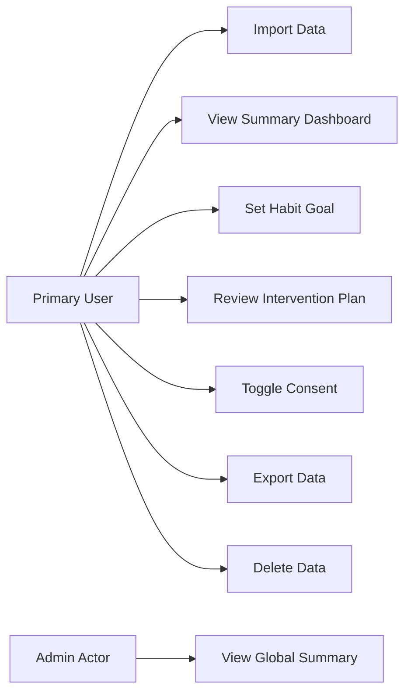
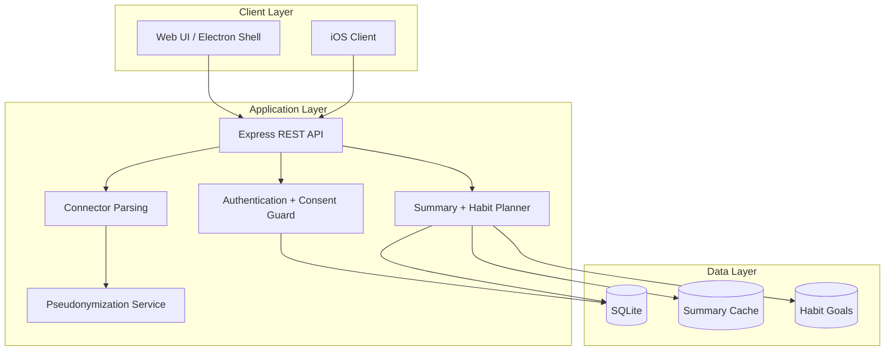
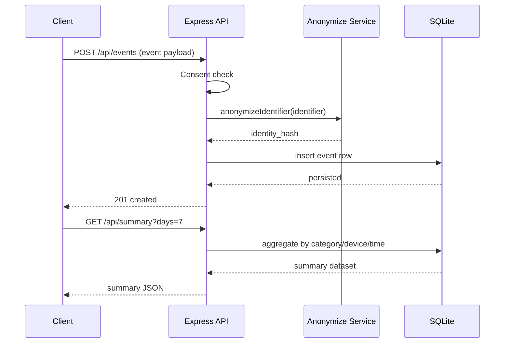
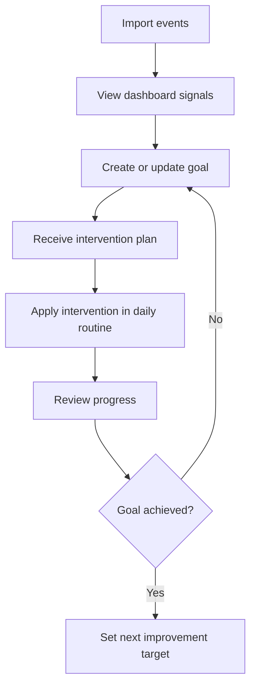

# Appendix E: Design Artefacts (Mermaid)

## E1. Use Case Overview

```mermaid
flowchart LR
    User[Primary User] --> UC1[Import Data]
    User --> UC2[View Summary Dashboard]
    User --> UC3[Set Habit Goal]
    User --> UC4[Review Intervention Plan]
    User --> UC5[Toggle Consent]
    User --> UC6[Export Data]
    User --> UC7[Delete Data]

    Admin[Admin Actor] --> UC8[View Global Summary]
```

## E2. Component Diagram

```mermaid
flowchart TB
    subgraph Client Layer
      UI[Web UI / Electron Shell]
      IOS[iOS Client]
    end

    subgraph Application Layer
      API[Express REST API]
      AUTH[Authentication + Consent Guard]
      IMPORT[Connector Parsing]
      ANALYTICS[Summary + Habit Planner]
      PRIVACY[Pseudonymization Service]
    end

    subgraph Data Layer
      SQLITE[(SQLite)]
      CACHE[(Summary Cache)]
      GOALS[(Habit Goals)]
    end

    UI --> API
    IOS --> API
    API --> AUTH
    API --> IMPORT
    API --> ANALYTICS
    IMPORT --> PRIVACY
    AUTH --> SQLITE
    ANALYTICS --> SQLITE
    ANALYTICS --> CACHE
    ANALYTICS --> GOALS
```

## E3. Sequence Diagram: Ingestion to Insight

```mermaid
sequenceDiagram
    participant Client
    participant API as Express API
    participant Privacy as Anonymize Service
    participant DB as SQLite

    Client->>API: POST /api/events (event payload)
    API->>API: Consent check
    API->>Privacy: anonymizeIdentifier(identifier)
    Privacy-->>API: identity_hash
    API->>DB: insert event row
    DB-->>API: persisted
    API-->>Client: 201 created

    Client->>API: GET /api/summary?days=7
    API->>DB: aggregate by category/device/time
    DB-->>API: summary dataset
    API-->>Client: summary JSON
```

## E4. Activity Flow: Behavior-Change Cycle

```mermaid
flowchart TD
    A[Import events] --> B[View dashboard signals]
    B --> C[Create or update goal]
    C --> D[Receive intervention plan]
    D --> E[Apply intervention in daily routine]
    E --> F[Review progress]
    F --> G{Goal achieved?}
    G -- No --> C
    G -- Yes --> H[Set next improvement target]
```
